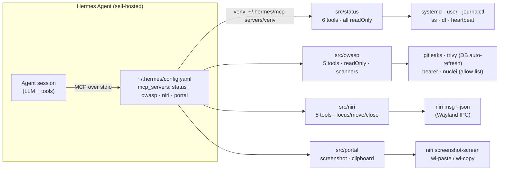
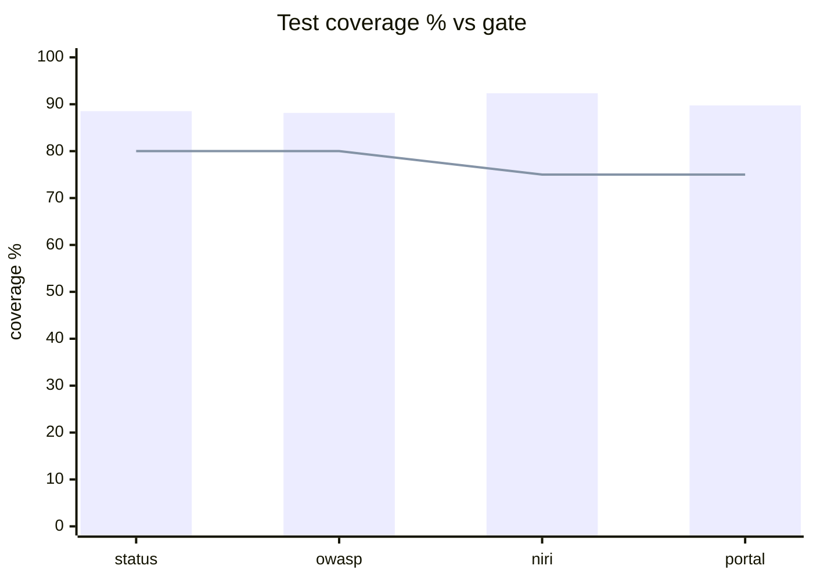

# Model Context Protocol servers

[](https://github.com/diluviumm/servers/actions/workflows/fork-ci.yml)
[](https://github.com/diluviumm/servers/actions/workflows/codeql.yml)

This repository is a collection of *reference implementations* for the [Model Context Protocol](https://modelcontextprotocol.io/) (MCP), as well as references to community-built servers and additional resources.

> [!NOTE]
> **Custom servers in this fork** — beyond upstream, this fork adds four production-wired servers used by a self-hosted Hermes Agent stack:
>
> | Server | Tools | Purpose |
> |---|---|---|
> | `src/status` | `health`, `recent_errors`, `services`, `ports`, `gateway_logs`, `config_view` | Infra health: gateway, tunnel, portal, systemd (timer-aware), ports, disk, RAM, load, trivy DB age, pattern-grouped error triage, redacted config view |
> | `src/owasp` | `gitleaks_scan`, `bearer_scan`, `trivy_fs`, `trivy_image`, `nuclei_scan` | Security scanning with code-enforced rails (nuclei allow-list = loopback + own domain only), auto trivy DB refresh, baseline/sarif/junit/markdown outputs, custom nuclei templates in `src/owasp/templates/` |
> | `src/niri` | `overview`, `focus_workspace`, `focus_window`, `move_window_to_workspace`, `close_window` | Niri compositor introspection + safe window-manager actions (no spawn/quit); Wayland/Niri socket auto-discovery for MCP's trimmed child env |
> | `src/portal` | `screenshot`, `clipboard_read`, `clipboard_write` | Desktop output gateway: PNG screenshot via niri `--write-to-disk` (new-file detection, no consent dialog) + wl-clipboard read/write |
>

> All four are plain FastMCP stdio servers (`mcp<2`, SDK 1.30) with pytest suites (`uv run pytest` per server directory, covered by `fork-ci.yml`). State/baselines live in `~/.hermes/mcp-servers/state/`.

**Architecture — how a call travels:**



**Coverage — measured locally (1 Oct 2026), gates in parentheses:**



**Tool safety map** (MCP tool annotations — every tool carries them):

| Server | Read-only (safe to call anytime) | State-changing |
|---|---|---|
| `status` | `health` `recent_errors` `services` `ports` `gateway_logs` `config_view` | — |
| `owasp` | `gitleaks_scan` `bearer_scan` `trivy_fs` (local) · `trivy_image` `nuclei_scan` (openWorld: network) | — |
| `niri` | `overview` | `focus_workspace` `focus_window` `move_window_to_workspace` (idempotent) · `close_window` (**destructive**) |
| `portal` | `clipboard_read` | `screenshot` (writes a file) · `clipboard_write` (**destructive**: overwrites clipboard) |

**Quickstart — use a custom server:**

```bash
# 1. one-shot quality gate (pytest+coverage, ruff, pyright — hermetic, agent-shell safe)
bash scripts/check.sh

# 2. call any tool from the CLI without a live agent
/home/mael/.hermes/mcp-servers/venv/bin/python scripts/mcp_stdio_test.py \
  src/status/server.py health '{}'

# 3. wire into Hermes (idempotent; already registered in ~/.hermes/config.yaml)
printf 'y\n' | hermes mcp add status \
  --command ~/.hermes/mcp-servers/venv/bin/python --args /abs/path/src/status/server.py
```

**Development (fork):**

- `scripts/check.sh` — one shot: pytest + coverage gate, ruff, pyright for all four packages
- `scripts/mcp_stdio_test.py` — call any server tool over stdio from the CLI (no live agent needed)
- Coverage gates enforced per package (`--cov-fail-under`: status **80** / owasp **80** / niri **75** / portal **75**) — suites: 67 tests total (status 18, owasp 27, niri 12, portal 10), CI matrix Python **3.10 + 3.12**
- A local `pre-push` hook runs the same pytest + coverage gates before every push (hermetic: sanitizes `PYTHONPATH`/`LD_*` leaked from agent shells)
- CodeQL scans (`codeql.yml`) run on every change to the custom servers
- Auto-sync: cron `fork-freshness-sync` (every 2 days, 04:15) fast-forwards from upstream and pushes; conflicts land in `~/.hermes/logs/errors.log`
- Every tool advertises MCP **tool annotations** (`readOnlyHint`/`destructiveHint`/`idempotentHint`/`openWorldHint`) so clients can tell read-only probes from state-changing actions

> [!IMPORTANT]
> If you are looking for a list of MCP servers, you can browse published servers on [the MCP Registry](https://registry.modelcontextprotocol.io/). The repository served by this README is dedicated to housing just the small number of reference servers maintained by the MCP steering group.

> [!WARNING]
> The servers in this repository are intended as **reference implementations** to demonstrate MCP features and SDK usage. They are meant to serve as educational examples for developers building their own MCP servers, not as production-ready solutions. Developers should evaluate their own security requirements and implement appropriate safeguards based on their specific threat model and use case.

The servers in this repository showcase the versatility and extensibility of MCP, demonstrating how it can be used to give Large Language Models (LLMs) secure, controlled access to tools and data sources.
Typically, each MCP server is implemented with an MCP SDK:

- [C# MCP SDK](https://github.com/modelcontextprotocol/csharp-sdk)
- [Go MCP SDK](https://github.com/modelcontextprotocol/go-sdk)
- [Java MCP SDK](https://github.com/modelcontextprotocol/java-sdk)
- [Kotlin MCP SDK](https://github.com/modelcontextprotocol/kotlin-sdk)
- [PHP MCP SDK](https://github.com/modelcontextprotocol/php-sdk)
- [Python MCP SDK](https://github.com/modelcontextprotocol/python-sdk)
- [Ruby MCP SDK](https://github.com/modelcontextprotocol/ruby-sdk)
- [Rust MCP SDK](https://github.com/modelcontextprotocol/rust-sdk)
- [Swift MCP SDK](https://github.com/modelcontextprotocol/swift-sdk)
- [TypeScript MCP SDK](https://github.com/modelcontextprotocol/typescript-sdk)

## 🌟 Reference Servers

These servers aim to demonstrate MCP features and the official SDKs.

- **[Everything](src/everything)** - Reference / test server with prompts, resources, and tools.
- **[Fetch](src/fetch)** - Web content fetching and conversion for efficient LLM usage.
- **[Filesystem](src/filesystem)** - Secure file operations with configurable access controls.
- **[Git](src/git)** - Tools to read, search, and manipulate Git repositories.
- **[Memory](src/memory)** - Knowledge graph-based persistent memory system.
- **[Sequential Thinking](src/sequentialthinking)** - Dynamic and reflective problem-solving through thought sequences.
- **[Time](src/time)** - Time and timezone conversion capabilities.

### Archived

The following reference servers are now archived and can be found at [servers-archived](https://github.com/modelcontextprotocol/servers-archived).

- **[AWS KB Retrieval](https://github.com/modelcontextprotocol/servers-archived/tree/main/src/aws-kb-retrieval-server)** - Retrieval from AWS Knowledge Base using Bedrock Agent Runtime.
- **[Brave Search](https://github.com/modelcontextprotocol/servers-archived/tree/main/src/brave-search)** - Web and local search using Brave's Search API. Has been replaced by the [official server](https://github.com/brave/brave-search-mcp-server) ([`@brave/brave-search-mcp-server`](https://www.npmjs.com/package/@brave/brave-search-mcp-server)).
- **[EverArt](https://github.com/modelcontextprotocol/servers-archived/tree/main/src/everart)** - AI image generation using various models.
- **[GitHub](https://github.com/modelcontextprotocol/servers-archived/tree/main/src/github)** - Repository management, file operations, and GitHub API integration.
- **[GitLab](https://github.com/modelcontextprotocol/servers-archived/tree/main/src/gitlab)** - GitLab API, enabling project management.
- **[Google Drive](https://github.com/modelcontextprotocol/servers-archived/tree/main/src/gdrive)** - File access and search capabilities for Google Drive.
- **[Google Maps](https://github.com/modelcontextprotocol/servers-archived/tree/main/src/google-maps)** - Location services, directions, and place details.
- **[PostgreSQL](https://github.com/modelcontextprotocol/servers-archived/tree/main/src/postgres)** - Read-only database access with schema inspection.
- **[Puppeteer](https://github.com/modelcontextprotocol/servers-archived/tree/main/src/puppeteer)** - Browser automation and web scraping.
- **[Redis](https://github.com/modelcontextprotocol/servers-archived/tree/main/src/redis)** - Interact with Redis key-value stores.
- **[Sentry](https://github.com/modelcontextprotocol/servers-archived/tree/main/src/sentry)** - Retrieving and analyzing issues from Sentry.io.
- **[Slack](https://github.com/modelcontextprotocol/servers-archived/tree/main/src/slack)** - Channel management and messaging capabilities. Now maintained by [Zencoder](https://github.com/zencoderai/slack-mcp-server)
- **[SQLite](https://github.com/modelcontextprotocol/servers-archived/tree/main/src/sqlite)** - Database interaction and business intelligence capabilities.

## 🚀 Getting Started

### Using MCP Servers in this Repository
TypeScript-based servers in this repository can be used directly with `npx`.

For example, this will start the [Memory](src/memory) server:
```sh
npx -y @modelcontextprotocol/server-memory
```

Python-based servers in this repository can be used directly with [`uvx`](https://docs.astral.sh/uv/concepts/tools/) or [`pip`](https://pypi.org/project/pip/). `uvx` is recommended for ease of use and setup.

For example, this will start the [Git](src/git) server:
```sh
# With uvx
uvx mcp-server-git

# With pip
pip install mcp-server-git
python -m mcp_server_git
```

Follow [these](https://docs.astral.sh/uv/getting-started/installation/) instructions to install `uv` / `uvx` and [these](https://pip.pypa.io/en/stable/installation/) to install `pip`.

### Using an MCP Client
However, running a server on its own isn't very useful, and should instead be configured into an MCP client. For example, here's the Claude Desktop configuration to use the above server:

```json
{
  "mcpServers": {
    "memory": {
      "command": "npx",
      "args": ["-y", "@modelcontextprotocol/server-memory"]
    }
  }
}
```

On Windows, wrap `npx` with `cmd /c`:

```json
{
  "mcpServers": {
    "memory": {
      "command": "cmd",
      "args": ["/c", "npx", "-y", "@modelcontextprotocol/server-memory"]
    }
  }
}
```

Additional examples of using the Claude Desktop as an MCP client might look like:

```json
{
  "mcpServers": {
    "filesystem": {
      "command": "npx",
      "args": ["-y", "@modelcontextprotocol/server-filesystem", "/path/to/allowed/files"]
    },
    "git": {
      "command": "uvx",
      "args": ["mcp-server-git", "--repository", "path/to/git/repo"]
    },
    "github": {
      "command": "npx",
      "args": ["-y", "@modelcontextprotocol/server-github"],
      "env": {
        "GITHUB_PERSONAL_ACCESS_TOKEN": "<YOUR_TOKEN>"
      }
    },
    "postgres": {
      "command": "npx",
      "args": ["-y", "@modelcontextprotocol/server-postgres", "postgresql://localhost/mydb"]
    }
  }
}
```

On Windows, apply the same wrapper to each `npx`-based entry above by changing `"command"` to `"cmd"` and prepending `"/c", "npx"` to the existing `args`. Leave `uvx` entries unchanged.

## 🛠️ Creating Your Own Server

Interested in creating your own MCP server? Visit the official documentation at [modelcontextprotocol.io](https://modelcontextprotocol.io/introduction) for comprehensive guides, best practices, and technical details on implementing MCP servers.

## 📚 Learn More

See [ADDITIONAL.md](ADDITIONAL.md) for a curated list of frameworks and resources that simplify building MCP servers and clients.

## 🤝 Contributing

See [CONTRIBUTING.md](CONTRIBUTING.md) for information about contributing to this repository.

## 📦 Releasing

See [RELEASING.md](RELEASING.md) for how packages are published (OIDC trusted publishing from CI — no registry tokens) and how to retry a failed publish.

## 🔒 Security

See [SECURITY.md](SECURITY.md) for reporting security vulnerabilities.

## 📜 License

This project is licensed under the Apache License, Version 2.0 for new contributions, with existing code under MIT - see the [LICENSE](LICENSE) file for details.

## 💬 Community

- [GitHub Discussions](https://github.com/orgs/modelcontextprotocol/discussions)

## ⭐ Support

If you find MCP servers useful, please consider starring the repository and contributing new servers or improvements!

---

Managed by Anthropic, but built together with the community. The Model Context Protocol is open source and we encourage everyone to contribute their own servers and improvements!
